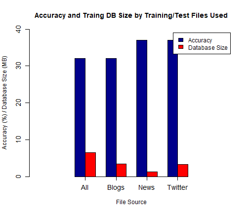
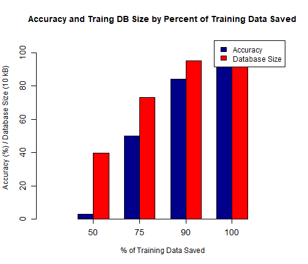
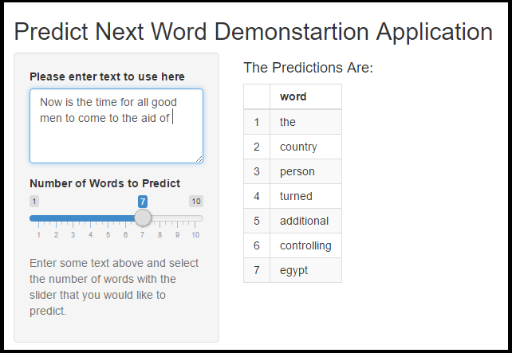

Next Word Prediction Algorithm Demonstration Shiny Application
===
<small>
Author: Paul Jefferies  
Date: 14-Mar-2017    
**Executive Summary**  
Next word prediction is used in many forms today from web browser/search
engine text entry to smart phone text entry to enable fast typing with and
to suggest items the user may not have considered.  
This project is an exercise in creating a 'next word' prediction algorithm
and shiny app to demonstrate the algorithm working.  
This demonstration uses a learned database based on the 'en_US.news.txt'
dataset found in the Coursera-SwiftKey database[1]. A random 1% of the 200
MB file was used with 60% of that list used for training and the remaining 40%
used for algorithm validation.  
The result is an accuracy rate of 58% to 79% depending on number of guesses
allowed. This prediction ability is demonstrated in a shiny app at the
following link. (<https://pjefferies.shinyapps.io/predict_next_word/>)</small>

Prediction Development
====================================
<small>The next word prediction algorithm was developed using the **tm**[2] and
the **RWeka**[3] packages for R. The following steps were performed starting
with a list of text selected to train on:
 1. Creating a Corpus (or body of docs) of the selected text.  
 2. Cleaning of the text to eliminate items such as email addresses,
 punctuation, bad words[4] and converting all text to lower case. These actions are done to improve the accuracy.  
 3. Collecting n-Grams (groups of 2 or more words close to each other). These
 are used to learn how words are related to previous words in the text. The n-Grams are weighted for the word predictability based on the following:  
   - Number of times the n-Gram is observed in training (more is better)
   - Number of words in the prediction sequence (more is better)
   - Number of gaps in the prediction sequence (less is better).
 4. Storing the learned word/combination words in an efficient matrix
 relating predictor words and predicted words.
- Through this development, many training and predicting parameters were
evaluate to optimize accuracy while minimizing training/predicting time and
training database size. The highlights of these trade-offs are shown next.</small>

Sample of Trade-offs Evaluated
==============================
left: 60%
<small>

1. Using all files (Blogs, News, Twitter) vs. single files.  
    **Result**: Using only News file resulted in highest accuracy and
    smallest database file.  
    
2. Removal of *stop words* that do not convey much meaning on their own.
There are 174 of these supplied in the **tm** package.  
    **Result**: For one word predictor, remove *stop words*. The words
    are too meaningless to give useful predictions. For 2+ word predictors,
    keep stop words as they can be useful in phrases.  
    
3. Percentage of Training Data To Use  
    **Result**: There is a large drop-off in accuracy and database size
    from trimming the model by percentage.</small>

***

Application Demonstration
=========================
left: 60%

   
Link to Application: (<https://pjefferies.shinyapps.io/predict_next_word/>)

***
**How it Works**
This is an image of the application. The text is entered in the box in the upper
left-hand corner. With the slider, between 1 and 10 words can be predicted. The prediction is updated when either the text or number of words is changed..

References
==========
^1 Data Source: Coursera-SwiftKey Text Database (<https://d396qusza40orc.cloudfront.net/dsscapstone/dataset/Coursera-SwiftKey.zip>)  
^2 **tm**: Ingo Feinerer and Kurt Hornik (2017). tm: Text Mining Package. R package version 0.7-1. <https://CRAN.R-project.org/package=tm>  
^3 **rWeka** package: Hornik K, Buchta C and Zeileis A (2009). "Open-Source Machine Learning: R Meets Weka." Computational Statistics, 24(2), pp. 225-232. doi: (<http://doi.org/10.1007/s00180-008-0119-7>).  
^4 Bad words database: <https://www.frontgatemedia.com/a-list-of-723-bad-words-to-blacklist-and-how-to-use-facebooks-moderation-tool/>  
 - Coursera/Johns Hopkins Data Science Capstone Course: <https://www.coursera.org/learn/data-science-project>  
